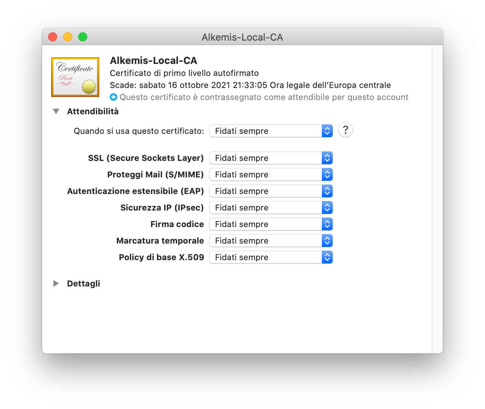

# Localhost Self Signed Certificate

## Create root ca
```bash
openssl req -x509 -nodes -new -sha256 -days 365 -newkey rsa:2048 -keyout RootCA.key -out RootCA.pem -subj "/C=IT/CN=Local-CA"
openssl x509 -outform pem -in RootCA.pem -out RootCA.crt
```


## Create local certificate

```bash
openssl req -new -nodes -newkey rsa:2048 -keyout localhost.key -out localhost.csr -subj "/C=IT/ST=Italy/L=Padova/O=Local-Certificates/CN=localhost"
openssl x509 -req -sha256 -days 365 -in localhost.csr -CA RootCA.pem -CAkey RootCA.key -CAcreateserial -extfile domains.ext -out localhost.crt
```


## Authorize root ca in macOS

Double click on **RootCA.crt** and install certificate then open keychain app and find your certificate.



#### Tips

- If you have some problem with Google Chrome try `chrome://restart` in url bar